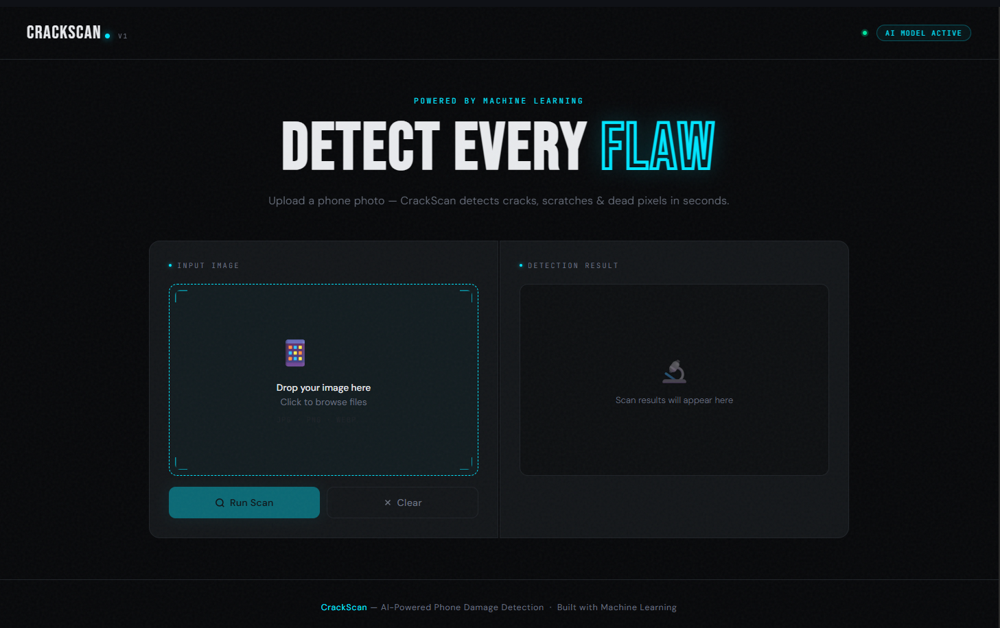
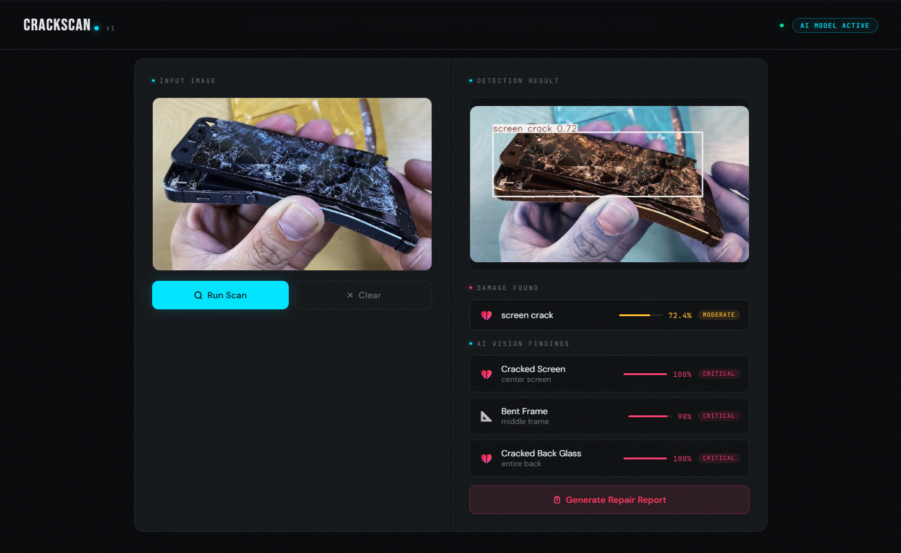
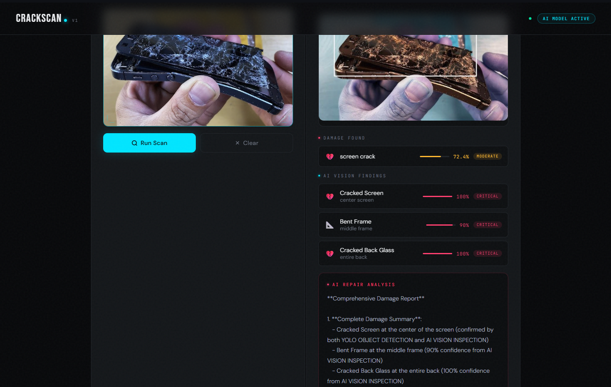

# 📱 Phone Damage Detector

> 🔍 Upload a photo. Detect the damage. Get a repair plan — instantly.

An AI-powered web application that detects physical damage on smartphones using a custom-trained **YOLOv8** model and generates detailed repair reports powered by **LLaMA 3.3** via Groq.

🌐 **Live Demo:** [phone-damage-detector.vercel.app](https://phone-damage-detector.vercel.app)

---

## 📸 Screenshots

> 💡 Replace the placeholders below with your actual screenshots. See [how to add images to a README](https://docs.github.com/en/get-started/writing-on-github/getting-started-with-writing-and-formatting-on-github/basic-writing-and-formatting-syntax#images).

**🏠 Home Page**

**🔎 Damage Detection Result**

**📋 AI Repair Report**

---

## ✨ Features

- 🤖 **AI Damage Detection** — Fine-tuned YOLOv8 model scans your phone photo and pinpoints damage zones with bounding boxes.
- 🖼️ **Annotated Output** — Get back an image with damage areas highlighted in real time.
- 📋 **Smart Repair Reports** — LLaMA 3.3-70B (via Groq) generates a full breakdown: severity level, repair steps, estimated cost, and usability verdict.
- ⚡ **Fast REST API** — Two clean endpoints: `/detect` and `/report`, built with FastAPI.
- 🎨 **Clean Frontend** — Lightweight HTML/CSS UI deployed on Vercel.

---

## 🛠️ Tech Stack

| Layer | Technology |
|---|---|
| 🧠 Object Detection | YOLOv8 (Ultralytics) |
| 💬 LLM / Report Generation | LLaMA 3.3-70B via Groq API |
| ⚙️ Backend | FastAPI + Uvicorn |
| 🎨 Frontend | HTML / CSS |
| 🚀 Deployment | Vercel (frontend) |

---

## 📁 Project Structure

- 🗂️ **Frontend/** — Static HTML/CSS frontend
- 🐍 **app.py** — FastAPI backend
- 🧠 **best.pt** — Trained YOLOv8 model weights
- 📄 **requirements.txt** — Python dependencies

---

## 🚀 Getting Started

### ✅ Prerequisites

- Python 3.9+
- A [Groq API key](https://console.groq.com/) 🔑

### 📦 Installation

1. **Clone the repository** from GitHub
2. **Install dependencies** using `pip install -r requirements.txt`
3. **Create a `.env` file** in the root directory and add your `GROQ_API_KEY`
4. **Run the app 🔥** with `python app.py` — the API will be live at `localhost:8000` 🎉

---

## 📡 API Reference

### `POST /detect` 🔎

Upload a phone image as `multipart/form-data`. Returns an annotated image (base64) and a list of detected damage labels with confidence scores.

### `POST /report` 📝

Send the list of detections as JSON. Returns an AI-generated repair report covering damage assessment, severity level, recommended repair steps, estimated cost range, and whether the phone is still usable.

---

## 📦 Dependencies

- **fastapi** — Web framework
- **uvicorn** — ASGI server
- **ultralytics** — YOLOv8 model
- **pillow** — Image processing
- **python-multipart** — File upload support
- **groq** — LLM API client
- **python-dotenv** — Environment variable management

---

## 🤝 Contributing

Got ideas or improvements? PRs are welcome! Feel free to fork the repo and open a pull request. 🙌

---

## 📜 License

This project is open source. Fork it, build on it, break it, fix it. 💪

---
